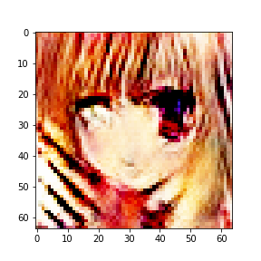
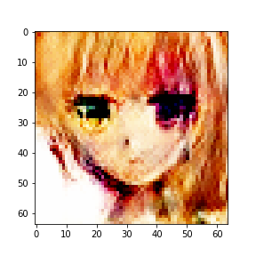
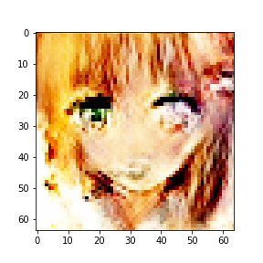

# Anime-DCGAN
### A DCGAN to generate anime faces 
### The model was trained on 2000 images for 5000 epochs
### The model was trained to generate images of size 64 * 64 with input noise of size 5 
<!-- --> 
<!-- --> 
<!-- --> 
### To train your DCGAN use the gan.ipynb 
### There are 500 images in images folder you can changes these images with any images of your choice with size 64 * 64 
### You can resize the images using rr.py
