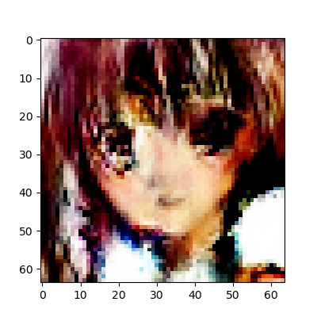
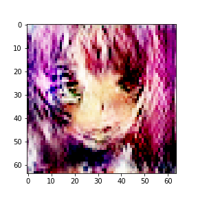
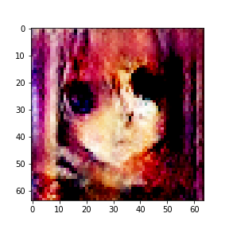

# Anime-DCGAN
### A DCGAN to generate anime faces 
### The model was trained on 2000 images for 5000 epochs
### The model was trained to generate images of size 64 * 64 with input noise of size 5 
<!-- --><br/>
<!-- --><br/>
<!-- --><br/>
### To train your DCGAN use the gan.ipynb 
### There are 500 images in images folder you can changes these images with any images of your choice with size 64 * 64 
### You can resize the images using rr.py
### Use commmand 
```python
python -d "directory of images to resize" -s "width height"
python -d D:/data/Anime-Gan/images/ -s 64 64
```
### you can change the size of input noise from 5 to any of your choice
```python
inputshape=5
```
### save the images in "images" folder
### Adjust the batch size according to you Gpu memory
### Generated images will be saved in folder "gen1" 
### Training checkpoints will be saved every 200 Epochs
### If in between the training your notebook crashes you can continue the training by restoring latest checkpoint
```python
checkpoint.restore(tf.train.latest_checkpoint(checkpoint_dir))
```
### To Generate images after training generate a random array between -1 1 of size inputshape 
```python
z1=np.random.uniform(-1., 1., size=[1, inputshape])
```
### Pass the array to generator model to produce image
```python
predictions = generator(z1, training=False)
fig = plt.figure(figsize=(4,4))
plt.imshow(predictions[0])
```


### use gan.ipynb to run on jupyter notebook or on colab
